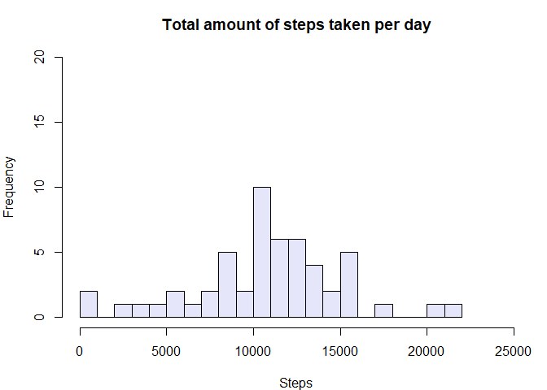
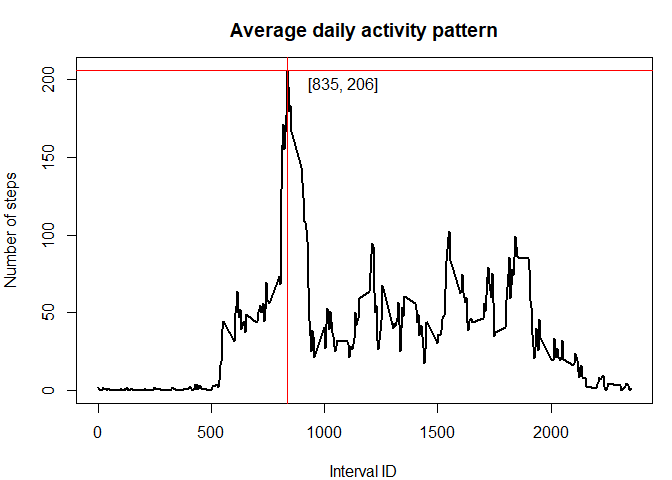
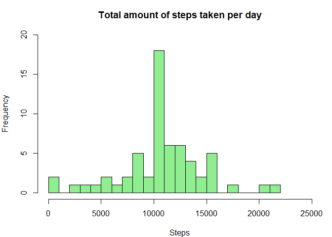

```r
library(dplyr)
```

```
## 
## Attaching package: 'dplyr'
```

```
## The following objects are masked from 'package:stats':
## 
##     filter, lag
```

```
## The following objects are masked from 'package:base':
## 
##     intersect, setdiff, setequal, union
```

## Loading and preprocessing the data

Download and extract files if the file has not been downloaded already


```r
if(!file.exists("./data")) {dir.create ("./data")}

if(!file.exists("./data/activity.zip")){
  
  fileUrl <- "https://d396qusza40orc.cloudfront.net/repdata%2Fdata%2Factivity.zip"
  download.file(fileUrl,"./data/activity.zip")
  unzip("./data/activity.zip", exdir = "./data")
}
```

Reading data into R. 


```r
mydata <- read.csv("./data/activity.csv")
mydata <- tbl_df(mydata)
select(mydata, date, interval, steps)
```

## What is mean total number of steps taken per day?

Calculating the total number of steps taken per day


```r
StepsPerDay <- mydata %>%
    group_by(date) %>%
    summarize(Total=sum(steps))
```

Making a histogram of the total number of steps taken each day


```r
par(mfrow = c(1,1), mar = c(4,4,3,1))
hist(StepsPerDay$Total, col = "lavender", main = "Total amount of steps taken per day", 
     ylab = "Frequency", xlab = "Steps", 
     breaks = 25, xlim = c(0, 25000), ylim = c(0,20))
```

<!-- -->

The mean and median of the total number of steps taken per day:

```r
mean(StepsPerDay$Total, na.rm = T)
```

```
## [1] 10766.19
```

```r
median(StepsPerDay$Total, na.rm = T)
```

```
## [1] 10765
```

## What is the average daily activity pattern?

Making a plot of the 5-minute interval (x-axis) and the average number of steps taken, averaged across all days (y-axis)


```r
DailyPattern <- mydata %>%
    group_by(interval) %>%
    summarize(Average=mean(steps, na.rm = T))
```


```r
par(mfrow = c(1,1), mar = c(4,4,3,1))
with(DailyPattern, plot(interval, Average, type = "l", lwd = 2, 
                        main = "Average daily activity pattern", 
                        ylab = "Number of steps", xlab = "Interval ID"))
MostActivInterval <- as.data.frame(DailyPattern[which.max(DailyPattern$Average), 1])
abline(v=MostActivInterval, h=max(DailyPattern$Average), col = "red")
text(x=MostActivInterval, y= max(DailyPattern$Average), labels = "[835, 206]", adj = c(-0.3,1.5))
```

<!-- -->

Find the interval with the highest average number of steps


```r
as.data.frame(DailyPattern[which.max(DailyPattern$Average), 1])
```

```
##   interval
## 1      835
```

## Imputing missing values

The total number of missing values in the dataset


```r
nrow(mydata[is.na(mydata$steps), ])
```

[1] 2304

Filling in all of the missing values in the dataset (substitute all NAs with means for this interval)


```r
# Determine which days have no data
NA_days <- as.vector(unique(mydata$date[is.na(mydata$steps)]))
sub_NA_data <- mydata[which(mydata$date %in% NA_days), ]

#  Substitute all NAs with means for this interval
fake_data <- sub_NA_data %>%
    group_by(date)%>%
    merge(DailyPattern, by = "interval") %>%
    select(date, interval, Average)%>%
    rename(steps = Average)

# Creating a new dataset with all missing data filled in
complete_data <- mydata[complete.cases(mydata), ]

new_dataset <- complete_data%>%
    rbind(fake_data) %>%
    arrange(date, interval)
```

Making a histogram of the total number of steps taken each day using new estimated data
 

```r
StepsPerDay2 <- new_dataset %>%
    group_by(date) %>%
    summarize(Total=sum(steps))
```


```r
par(mfrow = c(1,1), mar = c(4,4,3,1))
hist(StepsPerDay2$Total, col = "lightgreen", main = "Total amount of steps taken per day", 
     ylab = "Frequency", xlab = "Steps", 
     breaks = 25, xlim = c(0, 25000), ylim = c(0,20))
```

<!-- -->

The mean and median total number of steps taken per day (for new estimated dataset). 


```r
mean(StepsPerDay2$Total)
```

[1] 10766.19

```r
median(StepsPerDay2$Total)
```

[1] 10766.19

## Are there differences in activity patterns between weekdays and weekends?


```r
# 
new_dataset[, "date"] <- as.POSIXct(new_dataset$date, format = "%Y-%m-%d")
# Creating a new column which will show the day of a week for each date
new_dataset <- new_dataset %>%
    mutate(Day_of_week = weekdays(date)) %>%
# Creating a new factor variable with two levels - "weekday" and "weekend" indicating whether a given date is a weekday or weekend day
    mutate(WeekdayWeekend = ifelse(Day_of_week %in% c("Sunday", "Saturday"), 
                                   "Weekend", "Weekday")) 
# Calculating a daily patterns depending on whether it is a weekday or a weekend
DailyPattern2 <- new_dataset %>%
    group_by(interval, WeekdayWeekend) %>%
    summarize(Average=mean(steps, na.rm = T))    
```

Making a plot of the 5-minute interval (x-axis) and the average number of steps taken, averaged across all weekday days or weekend days (y-axis).


```r
par(mfrow = c(2,1), mar = c(4,4,2,1))
with(DailyPattern2[DailyPattern2$WeekdayWeekend == "Weekday", ], plot(interval, Average, 
                        col = "blue",type = "l", lwd = 2, 
                        main = "Average Weekdays activity pattern", 
                        ylab = "Steps", xlab = "", ylim = c(0,230)))
with(DailyPattern2[DailyPattern2$WeekdayWeekend == "Weekend", ], plot(interval, Average,
                        type = "l", lwd = 2, 
                         main = "Average Weekends activity pattern", 
                         ylab = "Steps", xlab = "Interval ID", ylim = c(0,230)))
```

<!-- -->
